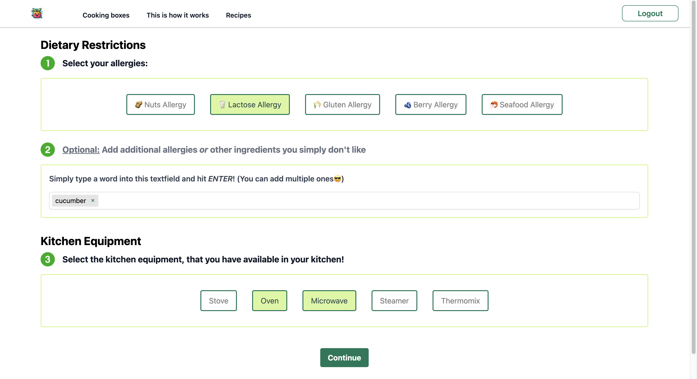

# Hackatum_Enze1

## Installation

Before running the application, make sure you have Python installed on your machine. You can download Python from [here](https://www.python.org/downloads/).

Next, install the required packages using pip:

pip install -r requirements.txt

## Run the application:
run in /Enze1/: < uvicorn main:app --reload --port 8000 >

The Webapp will be available on http://localhost:8000

## Webapp Preview

  
  

